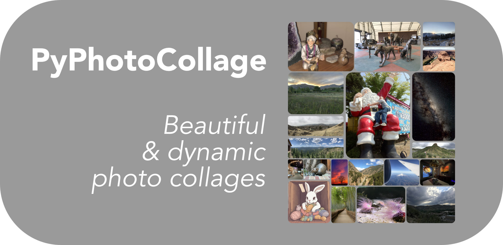
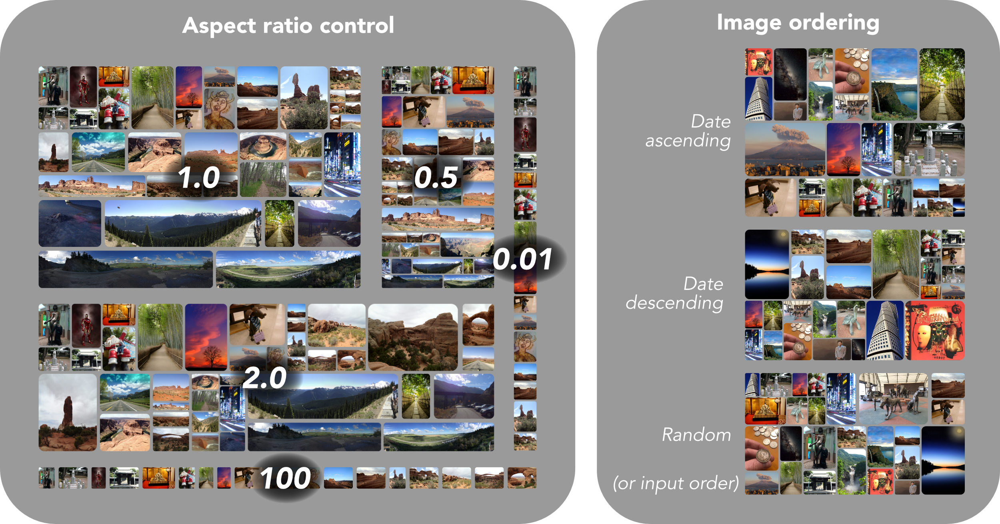
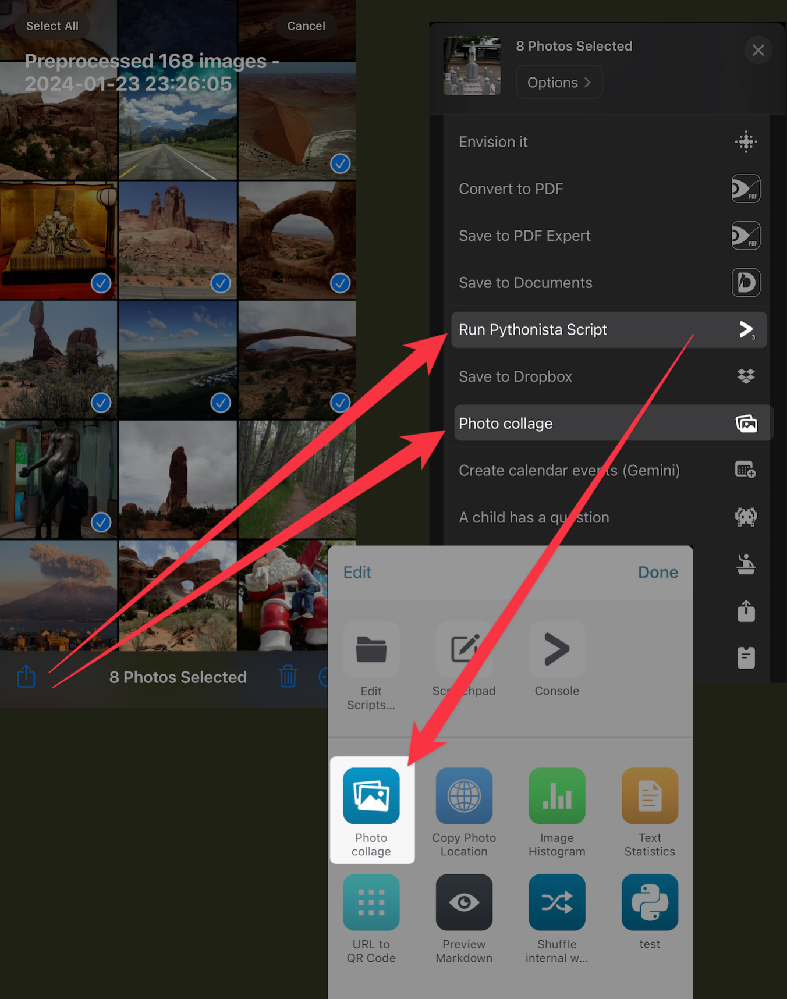
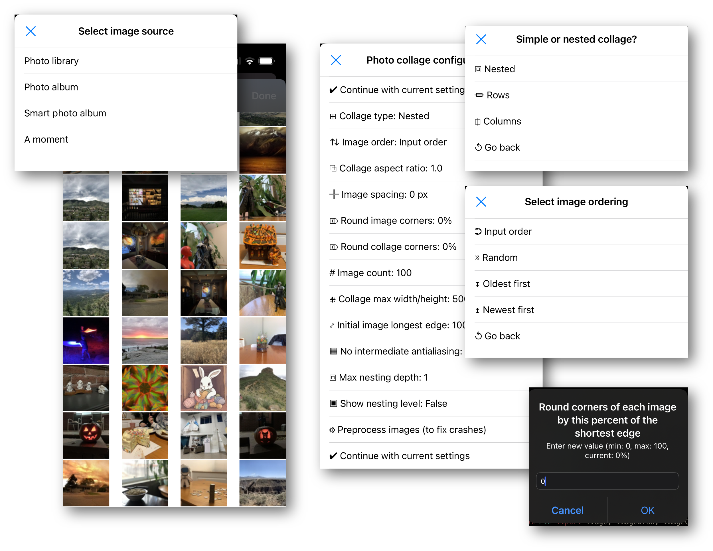
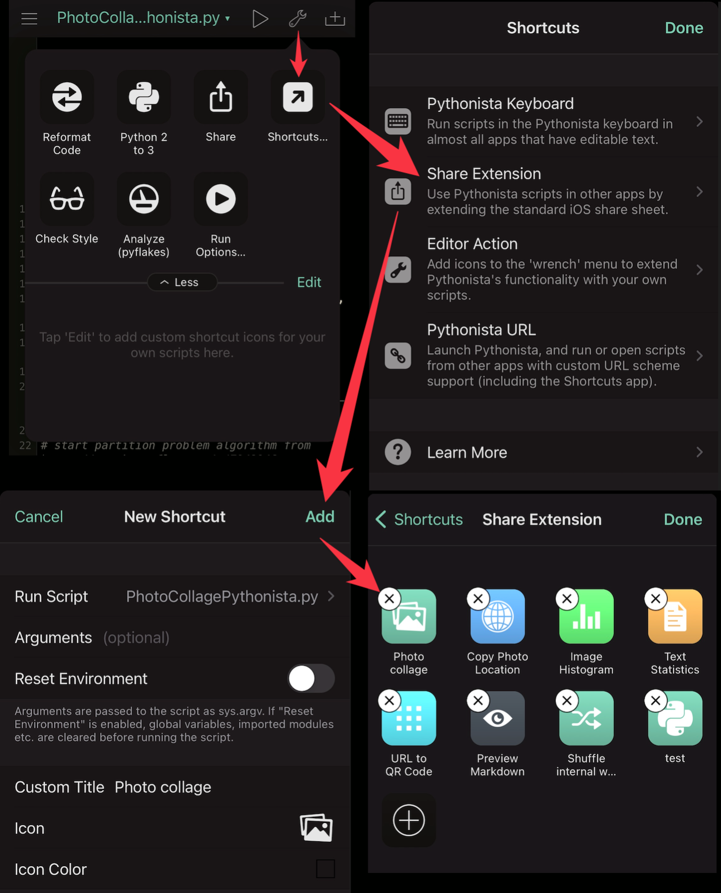
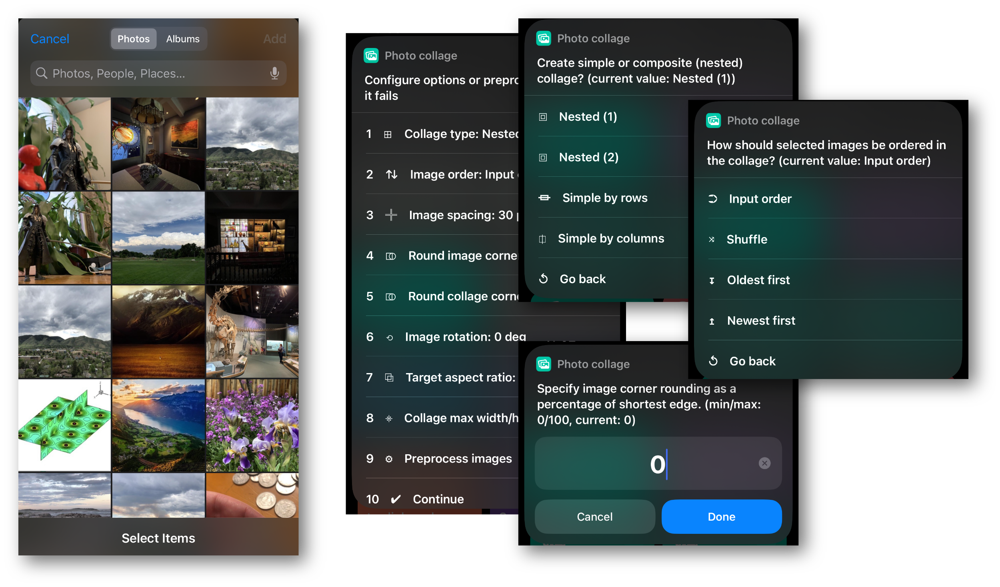

# PyPhotoCollage

Combines 3 or more images into a collage, maintaining image aspect ratios and distributing images evenly.

Dissatisfied with the Siri Shortcuts image gridding capability, I wanted a photo collage tool that can distribute images evenly. It grew into the current utility.

After looking around, the idea for this tool came from [Johannes Treitz's](https://medium.com/@jtreitz) [blog post](https://medium.com/@jtreitz/the-algorithm-for-a-perfectly-balanced-photo-gallery-914c94a5d8af).
The problem is reduced to the [partition problem](http://www8.cs.umu.se/kurser/TDBAfl/VT06/algorithms/BOOK/BOOK2/NODE45.HTM), for which I used [this SO implementation](https://stackoverflow.com/a/7942946).
Main function was modified (significantly) from [delimitry's _collage_maker_](https://github.com/delimitry/collage_maker).




# Notes for Pythonista and Siri Shortcut versions

* Photo collage can crash if too much memory is used
* If this happens, use the included "Preprocess images" utility to downscale images to a smaller size, then rerun Photo collage
* It will also run faster if preprocessing is done first
* Can run by sharing images from the Share Sheet (works better with Siri Shortcut; Pythonista version makes you reselect images)



# [Pythonista](http://omz-software.com/pythonista/) version for iPhone/iPad/Apple Silicon Mac

* Takes no arguments.
* Options are specified by the user when run.
* Simply place in the app, locally or though iCloud.
* If you want to run it from _e.g._ iOS Shortcuts, you'll need to store it locally.
* If you want to run it from the Share Sheet, you'll need to add it to the Pythonista extension (see image below)
  * Due to limitations in Pythonista, starting Photo collage from the share sheet *will not pass through the selected images; you'll need to reselect them*
  * It crashes when more than a handful of images are passed via the share sheet, so I had to revert that functionality




  
# [Native Siri Shortcut](https://routinehub.co/shortcut/17870/)

* PyPhotoCollage is also implemented as a vanilla Siri Shortcut that runs on Mac/iPhone/iPad
* Has all the same options and capabilities
* *It's slow compared to the Python version; very slow*



# Mac/PC CLI version

## Requirements

* Python3
* PIL (Pillow)

## Usage

```
usage: PhotoCollage.py [-h] [-f FOLDER] [-R] [-F FILE] [-o OUTPUT] [-t COLLAGE_TYPE] [-O ORDER] [-S MAX_SIZE] [-r TARGET_ASPECT_RATIO] [-g IMAGEGAP] [-m ROUND_IMAGE_CORNERS_PERC]
                       [-M ROUND_COLLAGE_CORNERS_PERC] [-b BACKGROUND] [-c COUNT] [-a] [-i INIT_SIZE] [-N MAX_RECURSION_DEPTH] [-s]
                       [files ...]

Photo collage maker

positional arguments:
  files

options:
  -h, --help            show this help message and exit
  -f FOLDER, --folder FOLDER
                        folder with 3 or more images (*.jpg, *.jpeg, *.png)
  -R, --recurse-input-folder
                        recurse into subfolders of input folder
  -F FILE, --file FILE  file with newline separated list of 3 or more files
  -o OUTPUT, --output OUTPUT
                        output collage image filename
  -t COLLAGE_TYPE, --collage-type COLLAGE_TYPE
                        collage type (default: nested; possible: nested, row, column)
  -O ORDER, --order ORDER
                        order of images (default: input_order; possible: filename, random, oldest_first, newest_first, input)
  -S MAX_SIZE, --max_collage_size MAX_SIZE
                        cap the longest edge (width or height) of resulting collage
  -r TARGET_ASPECT_RATIO, --target-aspect-ratio TARGET_ASPECT_RATIO
                        target aspect ratio for collage
  -g IMAGEGAP, --gap-between-images IMAGEGAP
                        number of pixels of transparent space (if saving as png file; otherwise black or specified background color) to add between neighboring images
  -m ROUND_IMAGE_CORNERS_PERC, --round-image-corners-perc ROUND_IMAGE_CORNERS_PERC
                        percentage of shortest image edge to use as radius for rounding image corners (0.0 to 100.0)
  -M ROUND_COLLAGE_CORNERS_PERC, --round-collage-corners-perc ROUND_COLLAGE_CORNERS_PERC
                        percentage of shortest collage edge to use as radius for rounding collage corners (0.0 to 100.0)
  -b BACKGROUND, --background-color BACKGROUND
                        color (r,g,b) to use for background if spacing is added between images
  -c COUNT, --count COUNT
                        count of images to use, if fewer are desired than those specified or contained in the specified folder
  -a, --no-no_antialias-when-resizing
                        for performance, disable antialiasing on intermediate resizing of images (runs faster but output image looks worse; final resize is always antialiased)
  -i INIT_SIZE, --init-image-size INIT_SIZE
                        to derease necessary memory, resize images on input to set longest edge length
  -N MAX_RECURSION_DEPTH, --max-nested-collage-depth MAX_RECURSION_DEPTH
                        maximum number of levels of nesting. The more levels there are, the larger the size difference will be between the smallest and largest images in the
                        resulting collage (default: 2)
  -s, --show-recursion-depth
                        show recursion depth by adding border to images
```

